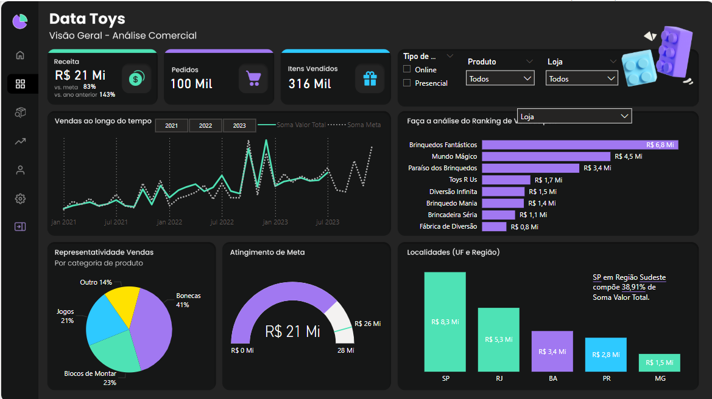
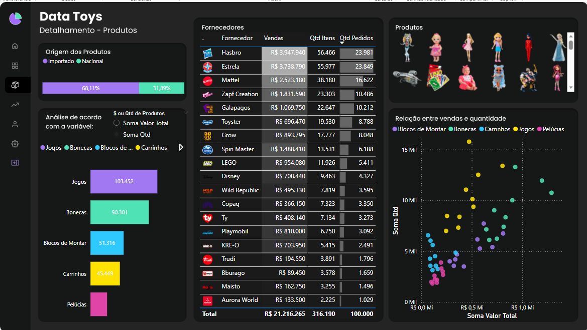
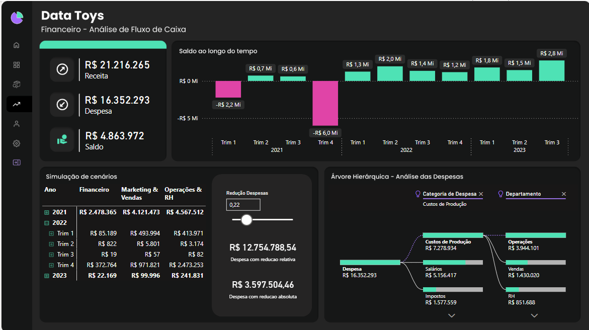

# Estudo de Caso: **Toystore** – Análise com Power BI

Este repositório contém um estudo de caso desenvolvido no **Power BI**, com foco na análise de dados de uma loja fictícia de brinquedos chamada *Toystore*. O projeto foi realizado como parte do curso **DataDriven**, ministrado por **Leticia Ismirele** e **Karine Lagos**, com o objetivo de aplicar conceitos de visualização e análise de dados em um contexto realista.

---

## 📊 Requisitos
### Análise Comercial
- **Total vendido por período**: análise temporal das vendas para identificar sazonalidades e tendências.
- **Receita total**: consolidação das receitas gerais.
- **Quantidade de itens vendidos**: volume total de produtos vendidos.
- **Quantidade de pedidos**: número total de transações realizadas.
- **Quantidade de itens por pedido**: média de produtos vendidos por transação.
- **Ranking de produtos**: identificação dos melhores e piores produtos em termos de vendas e receita.
- **Análise de receita por loja, produto, UF e categoria**: detalhamento geográfico e categórico das vendas.
- **Receita vs Meta**: comparação entre os resultados alcançados e os objetivos planejados por período e produto.
- **Simulações**: projeções para cenários estratégicos variados.
### Análise de Produtos
- **Produtos mais vendidos**: os itens com maior volume de vendas.
- **Categorias mais vendidas**: análise das categorias mais populares entre os consumidores.
- **Receita por origem de produto**: identificação das origens que geram maior receita.
- **Maiores fornecedores/marcas**: marcas e fornecedores com maior contribuição para a receita total.
### Análise Financeira
- **Visão de saldo por data**: evolução do saldo disponível ao longo do tempo.
- **Gastos por categorias e despesas**: identificação das principais fontes de custo.
- **Gastos por departamento**: análise das despesas por setor da empresa.
- **Principais gastos**: detalhamento das maiores fontes de despesa.
- **Saldo geral**: resumo financeiro consolidado, demonstrando a saúde financeira da empresa.

---

## 🗂️ Base de Dados

---

## 🛠️ Ferramentas Utilizadas
- **Microsoft Power BI**: desenvolvimento dos dashboards interativos.
- **Microsoft Excel**: apoio na manipulação e organização dos dados brutos.
- **DAX e Power Query**: criação de medidas, colunas calculadas e transformação dos dados.

---

## 📈 Resultados

- **Análise Comercial**

- **Análise de Produtos**

- **Análise Financeira**

Para explorar e interagir com o relatório completo, acesse o link abaixo:

[🔗 Clique aqui para interagir com o relatório](https://app.powerbi.com/reportEmbed?reportId=2133d8d7-e6a6-46cf-9c4c-920837952905&autoAuth=true&ctid=d4f732bb-4afd-44b5-abea-ec3fa01667de)

---

### 👩‍💻 Contato

Estou disponível para propostas de emprego, auditorias de dados ou projetos relacionados à análise e visualização de dados. 
Todos os meus contatos estão disponíveis na minha página inicial do GitHub: [beto86](https://github.com/beto86). 
Sinta-se à vontade para visitar e entrar em contato!

